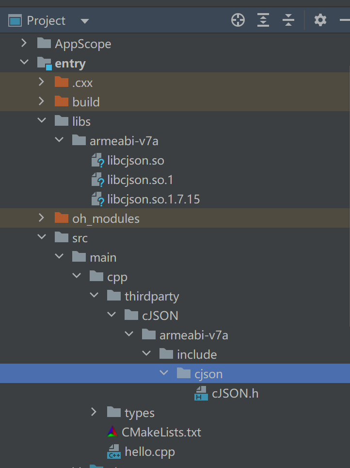

# 在MacOS上使用OpenHarmony SDK交叉编译 cJSON

本文以 cJSON 三方库为例，介绍如何通过 OpenHarmony 的 SDK 在 Mac 平台进行交叉编译。

## 环境准备

### SDK 准备

我们可以通过 OpenHarmony SDK [官方发布渠道](https://gitee.com/openharmony-sig/oh-inner-release-management/blob/master/Release-Testing-Version.md) 下载对应 Mac 版本的 SDK。当前 OpenHarmony Mac 版本的 SDK 有两种，一种是 x86 架构，另一种是 arm64 架构。我们需要根据自身设备的架构信息选择对应的版本。本示例中使用的 Mac 设备是 M 系列芯片，其架构是 arm64 的，因此我们选择 arm64 架构的 SDK。

```shell
cd ~                        # 进入到用户目录
curl -L http://download.ci.openharmony.cn/version/Master_Version/OpenHarmony_4.0.10.5/20230824113825/20230824113825-L2-SDK-MAC-M1-FULL.tar.gz --output ohos-sdk.tar.gz  # 通过 curl 命令下载工具链
```

下载完 SDK 后对其进行解压：

```shell
tar -zxvf ohos-sdk.tar.gz                           # 解压 ohos sdk
cd sdk/packages/ohos-sdk/darwin/                    # 进入到 darwin 目录
unzip native-darwin-arm64-4.0.10.5-Release.zip      # 因为 c/c++ 库的编译只涉及到 native 工具，因此我们只需要解压 native 工具即可。
```

### cmake 工具准备

cJSON 是通过 cmake 构建方式进行编译的，所以在编译前我们需要确保编译机上 cmake 能正常使用。

原则上我们需要使用 SDK 提供的 cmake 进行编译，但当前 SDK 中的 cmake 是 X86 架构，在 arm 架构的编译机上无法使用，因此我们需要在编译机上安装系统的 cmake 命令：

```shell
brew install cmake          # 通过 brew 包管理工具安装 cmake 工具
```

由于 cmake 官方不支持 OHOS，在编译过程中可能会因为无法识别 OHOS 而导致编译错误。因此我们需要在系统 cmake 中添加 OHOS 的配置，方法如下：

```shell
cp sdk/packages/ohos-sdk/darwin/native/build-tools/cmake/share/cmake-3.16/Modules/Platform/OHOS.cmake /opt/homebrew/Cellar/cmake/3.28.0/share/cmake/Modules/Platform/
```

### cJSON 源码准备

适配三方库如果没有指定版本，我们一般取三方库最新版本，不建议使用 master 的代码。这里我们下载 cJSON v1.7.15 版本的源码：

```shell
cd ~/Workspace
git clone https://github.com/DaveGamble/cJSON.git -b v1.7.15       # 通过 git 下载指定版本的源码
```

## 编译 & 安装

### 1\. 新建编译目录

为了不污染源码目录文件，我们推荐在三方库源码目录新建一个编译目录，用于生成需要编译的配置文件。本用例中我们在 cJSON 目录下新建一个 build 目录：

```shell
cd cJSON                             # 进入 cJSON 目录
mkdir build && cd build              # 创建编译目录并进入到编译目录
```

### 2\. 配置交叉编译参数，生成 Makefile

官方给的参数如下，我们需要根据自己的设备更改为合适的目录：

```shell
cmake -DCMAKE_TOOLCHAIN_FILE=/Users/ohos/sdk/packages/ohos-sdk/darwin/native/build/cmake/ohos.toolchain.cmake -DCMAKE_INSTALL_PREFIX=/Users/ohos/Workspace/usr/cJSON -DOHOS_ARCH=arm64-v8a .. -L             # 执行 cmake 命令
```

参数说明：

1.  **CMAKE_TOOLCHAIN_FILE** ：交叉编译配置文件路径，必须设置成工具链中的配置文件。
2.  **CMAKE_INSTALL_PREFIX** ：配置安装三方库路径。
3.  **OHOS_ARCH** ：配置交叉编译的 CPU 架构，一般为 arm64-v8a（编译 64 位的三方库）、armeabi-v7a（编译 32 位的三方库）。软件所为 armeabi-v7a 的 32 位设备。
4.  **-L** ：显示 cmake 中可配置项目。

更改后的参数为：

```shell
cmake -DCMAKE_TOOLCHAIN_FILE=/Users/sunfeiyu/sdk/packages/ohos-sdk/darwin/native/build/cmake/ohos.toolchain.cmake -DCMAKE_INSTALL_PREFIX=/Users/sunfeiyu/Workspace/cJSON -DOHOS_ARCH=armeabi-v7a .. -L
```

### 3\. 执行编译

cmake 执行成功后，在 build 目录下生成了 Makefile，我们就可以直接执行 make 对 cJSON 进行编译了：

```shell
make                  # 执行 make 命令进行编译
```

### 4\. 查看编译后文件属性

编译成功后我们可以通过 file 命令查看文件的属性，以此判断交叉编译是否成功。如下信息显示 libcjson.so 为 aarch64 架构文件，即交叉编译成功（软件所为 armeabi-v7a 的 32 位设备）：

```shell
file libcjson.so.1.7.15     # 查看文件属性命令
libcjson.so.1.7.15: ELF 64-bit LSB shared object, ARM aarch64, version 1 (SYSV), dynamically linked, BuildID[sha1]=c0aaff0b401feef924f074a6cb7d19b5958f74f5, with debug_info, not stripped
```

### 5\. 执行安装命令

编译成功后，我们可以执行 make install 将编译好的二进制文件以及头文件安装到 cmake 配置的安装路径下：

```shell
make install                # 执行安装命令
```

## 测试

交叉编译完成后，需要对三方库进行测试验证。

### 1\. 文件配置

在 DevEco-Studio 上新建一个 NativeC++ 工程，新建文件夹如下：



进入工作目录：

```shell
cd ~/Workspace/cJSON && ls
```

有目录 lib 和目录 include。将目录 lib 里面的文件 libcjson.so、libcjson.so.1、libcjson.so.1.7.15 三个文件拷贝到 NativeC++ 工程中 /entry/libs/armeabi-v7a 目录下。将目录 include 里面的文件 cJSON.h 拷贝到 NativeC++ 工程中 /entry/src/main/cpp/thirdparty/cJSON/armeabi-v7a/include/cjson 目录下，使得整个项目结构符合上图。

### 2\. 更改 CMakeLists.txt 文件

```cmake
# the minimum version of CMake.
cmake_minimum_required(VERSION 3.4.1)
project(MyApplication5)

set(NATIVERENDER_ROOT_PATH ${CMAKE_CURRENT_SOURCE_DIR})
set(CJSON_LIB_PATH ${NATIVERENDER_ROOT_PATH}/../../../libs/${OHOS_ARCH})

# 添加头文件路径
include_directories(
    ${NATIVERENDER_ROOT_PATH}
    ${NATIVERENDER_ROOT_PATH}/include
    ${NATIVERENDER_ROOT_PATH}/thirdparty/cJSON/${OHOS_ARCH}/include
)

# 添加共享库
add_library(entry SHARED hello.cpp)

# 链接库
target_link_libraries(entry PUBLIC
    libace_napi.z.so
    libace_ndk.z.so
    librawfile.z.so
    libhilog_ndk.z.so
    ${CJSON_LIB_PATH}/libcjson.so
)
```

更改 hello.cpp 的代码：

```c++
#include "napi/native_api.h"
#include "hilog/log.h"
#include "cjson/cJSON.h"

#define GLOBAL_RESMGR (0xFFEE)

static const char *TAG = "[cjsontest]";

static napi_value Add(napi_env env, napi_callback_info info) {
    size_t requireArgc = 2;
    size_t argc = 2;
    napi_value args[2] = {nullptr};

    napi_get_cb_info(env, info, &argc, args, nullptr, nullptr);

    napi_valuetype valuetype0;
    napi_typeof(env, args[0], &valuetype0);

    napi_valuetype valuetype1;
    napi_typeof(env, args[1], &valuetype1);

    double value0;
    napi_get_value_double(env, args[0], &value0);

    double value1;
    napi_get_value_double(env, args[1], &value1);

    // 增加cjson测试代码
    cJSON *parsed = NULL;
    char *content = "[\"Sunday\", \"Monday\", \"Tuesday\", \"Wednesday\", \"Thursday\", \"Friday\", \"Saturday\"]";
    OH_LOG_Print(LOG_APP, LOG_ERROR, GLOBAL_RESMGR, TAG, "content %{public}s.", content);

    parsed = cJSON_Parse(content);

    char *jsonmsg = cJSON_Print(parsed);
    OH_LOG_Print(LOG_APP, LOG_ERROR, GLOBAL_RESMGR, TAG, "jsonprint %{public}s.", jsonmsg);

    napi_value sum;
    napi_create_double(env, value0 + value1, &sum);

    return sum;
}

EXTERN_C_START
static napi_value Init(napi_env env, napi_value exports) {
    napi_property_descriptor desc[] = {{"add", nullptr, Add, nullptr, nullptr, nullptr, napi_default, nullptr}};
    napi_define_properties(env, exports, sizeof(desc) / sizeof(desc[0]), desc);
    return exports;
}
EXTERN_C_END

static napi_module demoModule = {
    .nm_version = 1,
    .nm_flags = 0,
    .nm_filename = nullptr,
    .nm_register_func = Init,
    .nm_modname = "entry",
    .nm_priv = ((void *)0),
    .reserved = {0},
};

extern "C" __attribute__((constructor)) void RegisterEntryModule(void) { napi_module_register(&demoModule); }
```

### 3\. 执行测试

编译后安装到开发板上，触发ets的点击时间后控制台输出如下
```
08-14 19:10:49.204   26303-26303  A0ffee/[cjsontest]             com.examp...lication  E     content ["Sunday", "Monday", "Tuesday", "Wednesday", "Thursday", "Friday", "Saturday"].
08-14 19:10:49.204   26303-26303  A0ffee/[cjsontest]             com.examp...lication  E     jsonprint ["Sunday", "Monday", "Tuesday", "Wednesday", "Thursday", "Friday", "Saturday"
```
